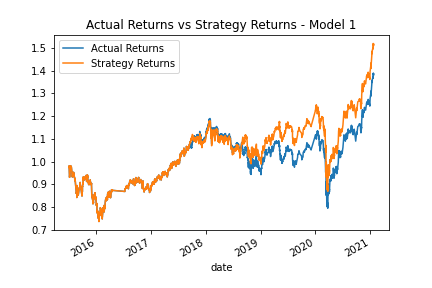
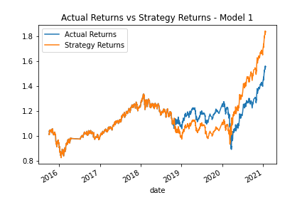
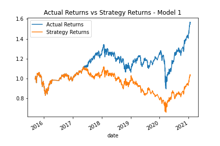
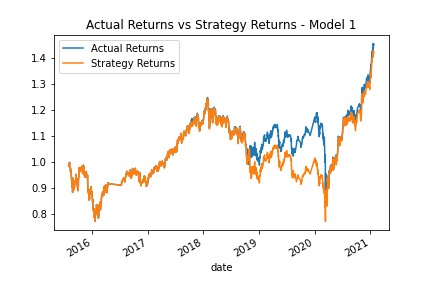

# Fintech_Challenge_14
UW Fintech Bootcamp Challenge 14

# Model 1
Model one has a DateOffset of 3 months
SMA short =4

# Model 2
Model two has a DateOffset of 6 months
SMA short=4

# Model 3
Model three has a DateOffset of 3 months
SMA short=20

# Model 4
Model four has a DateOffset of 4 months
SMA short =4

# Model Manipulation Analysis
When adjusting the SMA short and the SMA long (not pictured) it made the model's predictions less accurate. Therefore, further adjustments were made to the DateOffset to see if that would increase the accuracy of the predictions. While six month offset showed fair accuracy when comparing the actual returns line to the strategy returns, when the DateOffset was reset to 8 (not pictured) the resulting graph was less accurate. The final model chosen was a DateOffset of four months which once again shows the two lines running close together. 